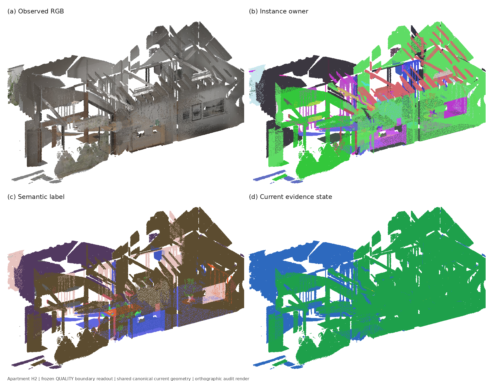

# CROVE multimethod readout — partial DEV evidence

Task revision: V1_REVISED_V2. Evaluated implementation: `aed101c` (execution before
commit; subsequent changes were formatting and equivalent loop unpacking only).
The paired adapter, semantic controls and initial graph batch use `1efef91`
(executed before commit; subsequent changes were formatting/import ordering and
the explicitly documented forward-count reporting correction).
The diverse/quality batch and real-posterior graph controls use `cbb6543`;
the tie-rule fix was verified by exact full-map prediction recomputation.
Independent-mask pipeline diagnostics use `943a96c` (subsequent pre-commit
changes were formatting and additional residual-count reporting only).
Apartment cached-view and adapter pairs use `d4e3d67`; the shared bridge extraction
preserves the executed cached-view computation and is exercised by the adapter pair.
Apartment diverse/quality and posterior graph controls use `43f8aae`;
the extracted evaluator AST is identical to the previously evaluated kernel.
Apartment independent-mask binding and restored-row attribution use `ba94d66`.
Apartment boundary controls and expanded geometry diagnostics use `541d853`.
Matched six-crop re-encoding uses `aa6c0e7` (crop-input helper extraction and
additional owner validation preserve the running encoding computation).
This is an intermediate result, not the final four-family screening report.

## room0 complete-surface initial batch

All rows use the same 9,282,303 native OVI source rows and owners, fixed Replica41
GT/crosswalk and strict 5 cm projection. Predictions were saved before opening GT.

| Method | mIoU | f-mIoU | CA-AP25 | CA-AP50 | Geometry F5 |
| --- | ---: | ---: | ---: | ---: | ---: |
| B_SEM_OVI_NATIVE | 0.340208 | 0.605177 | 0.562641 | 0.470711 | 0.935286 |
| MV_NATIVE_CACHED | 0.377473 | 0.598409 | 0.562641 | 0.470711 | 0.935286 |
| MV_SINGLE | 0.328337 | 0.561435 | 0.562641 | 0.470711 | 0.935286 |
| MV_TOPK_MEAN | 0.353902 | 0.605187 | 0.562641 | 0.470711 | 0.935286 |
| MV_DIVERSE_MEAN | 0.394472 | 0.407740 | 0.562641 | 0.470711 | 0.935286 |
| MV_QUALITY | 0.400847 | 0.408872 | 0.562641 | 0.470711 | 0.935286 |
| MV_CURRENT_AWARE (static QUALITY alias) | 0.400847 | 0.408872 | 0.562641 | 0.470711 | 0.935286 |

`B_SEM_OVI_NATIVE` uses the saved native semantic crosswalk. `MV_NATIVE_CACHED`
uses the official retained last-eight visibility-weighted six-crop features,
reclassified against the complete fixed 41-class vocabulary with bare class names.
It changes the text decision space relative to the saved native mapping; its
+0.037265 mIoU is not attributed solely to view selection. SINGLE and TOPK use
normalized per-view six-crop means and respectively one/four most-visible cached
views. The native cache already selected its candidate observations, so this
batch does not test new views outside the retained bank or individual crop scales.

The three new rows cover 99.8523% of surface rows (71 feature owners). Source
observation totals are 497, 71 and 272 respectively, all within the authorized
0:2000:10 input. Uncovered rows retain native predictions. No additional image
encoder forwards were used; one shared SigLIP text pass was run. Prediction and
sidecar-write time was approximately 6.2–6.4 seconds per new row, excluding shared
geometry/model loading and text encoding. Exact view lists and timings remain in
the local run directory. No end-to-end speedup is claimed.

DIVERSE and QUALITY reuse that same native six-crop cache and k=4 budget.
DIVERSE starts with the highest visible-area view and selects angularly diverse
camera directions around each owner's physical centroid. QUALITY uses exactly
those inputs, weighted by depth-consistent unique-pixel fraction, square-root
projected/native mask support and a 0.5 image-boundary truncation factor. The full
formula is frozen in `multiview_quality_room0_registry.json`; no GT is used.
There are 64 actual surface owners and 251 candidate observations (older initial
batch counts also included absent owners; their predictions were unaffected).
Coverage is 99.85233%/99.85201%; two zero-quality owners fall back. New image
forwards remain zero. Shared selection/projection take 9.22/14.87 s; prediction/write
takes 5.50/5.61 s. Higher mIoU comes with substantially lower f-mIoU, not an
across-metric improvement. Static CURRENT_AWARE is an exact QUALITY prediction
alias, not evidence for dynamic adaptation. Structural-background patch
observations still require separate work. The original room0 and native-build
`VLModel.encode_image_with_bbox` both normalize each of six crop features before
averaging; M1 subsequently normalizes that per-view mean. The prior statement
that per-crop normalization required re-encoding was incorrect. Individual crop
scale ablations are unavailable from these means, but the prescribed normalized
six-crop hierarchy is already present (also documented in task evidence E15).
The audited source SHA256 values are `607ed3d0ddf8eb39b8989e606d0d7797d8966bc902952fff819ccb020a5169a9`
(room0 checkout) and `b0925c0c78fd46be779fb9fbcde171fcaef58bd89a7f7d99b8fc1b24a1836ba2`
(native build). Native source manifest commit `58a804e2d7c82ba05a489eb071aba3367301fed8`
also contains this operation. These are source audits, not reconstructed raw crops.

S0 and S2 have now been rerun on this same complete surface (see below).
No winner has been frozen and no new deployment recommendation is made.

Executed command:

```bash
python scripts/evaluation/run_crove_multiview_room0.py
```

Outputs: `configs/evaluation/results/crove_multimethod_readout_v1/room0_*.json`.
Full prediction sidecars: `$HOME/oviovo_baseline_runs/20260912_crove_multimethod_readout_v1/dev/room0/native_cached_batch/`.

## Paired trained adapter and S2 graph DEV results

All rows below preserve the same 9,282,303 source rows and owners. CA-AP50
is 0.470711 and geometry F5 is 0.935286 throughout.

| Method | mIoU | f-mIoU |
| --- | ---: | ---: |
| B_SEM_CROVE_S0 | 0.399675 | 0.683362 |
| B_SEM_CROVE_S2 | 0.447889 | 0.673573 |
| ADAPTER_CLIP_MEAN | 0.364617 | 0.638058 |
| ADAPTER_CLIP_LEARNED | 0.396887 | 0.644932 |
| ADAPTER_LEARNED_PATCH_ONLY | 0.398003 | 0.645817 |
| ADAPTER_LEARNED_GRAPH_GEOM | 0.398174 | 0.645988 |
| S2_PATCH_ONLY | 0.443890 | 0.668636 |
| S2_GRAPH_GEOM | 0.443963 | 0.668539 |
| MV_QUALITY_PATCH_ONLY | 0.396774 | 0.409143 |
| MV_QUALITY_GRAPH_GEOM | 0.399117 | 0.409253 |
| S2_GRAPH_BOUNDARY | 0.443967 | 0.668553 |
| MV_QUALITY_GRAPH_BOUNDARY | 0.397928 | 0.409244 |

The adapter pair shares official trained ConvNeXt-L features, class text,
projected source-support masks, and selected views. Learned pooling improves
mIoU by 0.032270 over mean pooling but remains below S2. Depth-consistent source
projection uses a 5 cm tolerance without dilation; these owner-derived masks are
not independent M3 mask evidence. The bank contains 133 selected frames and 251
owner candidates; 130 actual image forwards yield 204 valid feature observations.
Both variants fall back identically on unsupported rows; coverage is 99.76885%.
Shared measured projection time is 7.06 s and frame processing time is 19.61 s,
excluding model loading, cache compression/writes and GT evaluation. Peak allocated
GPU memory is 1,738,725,376 bytes. The initial forward counter of 133 was corrected
to 130 from nonempty feature caches; predictions and scores were unchanged.

The limited M4+M2 combination reuses these trained-head posteriors and the same
fixed graph. Patch pooling adds 0.001116 mIoU over pointwise learned pooling;
geometry propagation adds another 0.000171. It remains below S2. Patch-only and
geometry inference take 0.38/12.58 s, excluding shared topology construction,
prediction serialization and evaluation. All unsupported point labels and all
source rows, owners and point confidences are preserved exactly.

M2 welds compatible repeated vertices and uses actual triangle topology, not global
kNN. The fixed 2 cm patches contain 629,549 nodes and 1,291,958 undirected edges,
with 100% source-row backprojection and 1,988,010 welded physical samples.
Patch construction took 22.30 s. S2 pseudo-unaries are confidence-weighted costs,
not recovered class posteriors. Five damped mean-field iterations use lambda 0.2.
Patch-only loses 0.003999 mIoU versus pointwise S2; graph propagation adds only
0.000074 over patch-only. This is a negative result versus S2, not a demonstrated
graph improvement.

M1-posterior controls reuse exactly the same patch mapping and geometry graph.
Actual full-class owner posteriors are averaged by physical mass before negative-log
costs; unsupported source rows keep M1 fallback. Reliability is not multiplied
again after M1 view weighting. Patch-only changes 43,178 source labels; graph
propagation changes a further 1,707 versus patch-only (43,268 versus pointwise M1).
Graph propagation recovers some patch loss but remains below pointwise QUALITY.
The posterior tie rule was strengthened to preserve the physically dominant
baseline class among cost minimizers; full-map recomputation verified zero
prediction changes for both saved variants. This is a current room0 M1 leader
control, not the final cross-protocol family selection.

The complete 200-frame independent mask bank now supports both boundary controls.
They share 1,226,948 jointly observed edges, 10,315 mask-disagreement edges and
1,235,005 RGB-supported edges, without changing nodes or topology. S2 boundary
adds only 0.0000032 mIoU over the geometry graph and still trails pointwise S2;
QUALITY boundary loses 0.0011895 versus its geometry graph. Both retain native
CA-AP50 and geometry F5. These results do not establish a boundary benefit.

### room0 full-input instance controls

All 200 authorized frames are used, with 5,719 input masks and 323 filtered
undersegmented/small mask nodes. Both methods preserve all 9,282,303 source rows,
point semantics and confidence; mIoU remains 0.340208 and geometry F5 0.935286.

| Owner rule | CA-AP25 | CA-AP50 | Recall50 | Evaluated instances |
| --- | ---: | ---: | ---: | ---: |
| Native OVI | 0.562641 | 0.470711 | 0.602941 | 68 |
| Pairwise | 0.154719 | 0.085962 | 0.205882 | 66 |
| Consensus | 0.416275 | 0.192182 | 0.411765 | 88 |

GT contains 68 instances. All rows use the same existing size-ranked protocol
and minimum-size filter. Consensus beats pairwise but is substantially worse
than native OVI; it is not an instance improvement. Pairwise/consensus change
9,077,644/9,070,892 rows, create 35/64 IDs and split 43/72 parents. Both touch
85 merge parents. They retain 204,632/211,384 parent-residual rows, with
204,652/211,404 unsupported or ambiguous source rows falling back. These residuals
are retained rather than deleted. Shared graph construction takes 25.86 s;
clustering/inference/write takes 41.87/44.21 s. Semantic-constrained AP remains
a separate diagnostic, not the headline instance result.

Reproduction commands:

```bash
/home/ww/oviovo_baseline_builds/maskadapter/venv/bin/python scripts/evaluation/run_crove_adapter_room0.py
python scripts/evaluation/run_crove_room0_semantic_controls.py
python scripts/evaluation/run_crove_graph_room0.py
python scripts/evaluation/run_crove_multiview_quality_room0.py
python scripts/evaluation/run_crove_graph_room0.py --unary mv_quality
python scripts/evaluation/run_crove_graph_room0.py --boundary
python scripts/evaluation/run_crove_graph_room0.py --unary mv_quality --boundary
python scripts/evaluation/run_crove_consensus_room0.py
```

## Other progress and remaining obligations

### Apartment cached-view B3/H2 DEV pair

Every method uses the exact saved B3 (15,622,601 rows) and H2 (15,625,540 rows)
current sets, unchanged owner IDs and the verified legacy evaluator row ordering.
Native features are hash-bound to the lifted entity manifests and color IDs.
Local frame IDs map to original 766–1021/1217–1472 windows, and t1 owners retain
the existing +1,000,000 offset. Text covers the complete public 20 known-class
common-v2 vocabulary, not classes selected from GT. No image encoder is rerun.

| State | Method | current mIoU | Surface precision | Surface F1 | Original gates |
| --- | --- | ---: | ---: | ---: | --- |
| B3 | MV_NATIVE_CACHED | 0.135886 | 0.734413 | 0.431335 | PASS |
| B3 | MV_SINGLE | 0.132403 | 0.669867 | 0.423467 | FAIL |
| B3 | MV_TOPK_MEAN | 0.139546 | 0.343176 | 0.324609 | FAIL |
| H2 | MV_NATIVE_CACHED | 0.135734 | 0.734726 | 0.435710 | PASS |
| H2 | MV_SINGLE | 0.133032 | 0.670218 | 0.427587 | FAIL |
| H2 | MV_TOPK_MEAN | 0.139394 | 0.343541 | 0.327174 | FAIL |
| B3 | MV_DIVERSE_MEAN | 0.135886 | 0.734413 | 0.431335 | PASS |
| B3 | MV_QUALITY | 0.137077 | 0.736586 | 0.434848 | PASS |
| H2 | MV_DIVERSE_MEAN | 0.135734 | 0.734726 | 0.435710 | PASS |
| H2 | MV_QUALITY | 0.137684 | 0.736894 | 0.439203 | PASS |
| B3 | MV_QUALITY_PATCH_ONLY | 0.137077 | 0.736694 | 0.434867 | PASS |
| B3 | MV_QUALITY_GRAPH_GEOM | 0.137093 | 0.736702 | 0.434868 | PASS |
| H2 | MV_QUALITY_PATCH_ONLY | 0.137684 | 0.737002 | 0.439222 | PASS |
| H2 | MV_QUALITY_GRAPH_GEOM | 0.137699 | 0.737010 | 0.439224 | PASS |
| B3 | MV_QUALITY_GRAPH_BOUNDARY | 0.137093 | 0.736702 | 0.434868 | PASS |
| H2 | MV_QUALITY_GRAPH_BOUNDARY | 0.137699 | 0.737010 | 0.439224 | PASS |
| B3 | ADAPTER_CLIP_MEAN | 0.115477 | 0.203297 | 0.244898 | FAIL |
| B3 | ADAPTER_CLIP_LEARNED | 0.135273 | 0.198584 | 0.241745 | FAIL |
| H2 | ADAPTER_CLIP_MEAN | 0.115927 | 0.203402 | 0.245449 | FAIL |
| H2 | ADAPTER_CLIP_LEARNED | 0.136847 | 0.201748 | 0.245421 | FAIL |

For the six M1 rows, Ghost remains 0 and background F1 remains 0.366360. Native cached
aggregation reproduces the original point semantics and roles exactly (zero
changed rows) and all nine legacy metrics in both states. SINGLE changes 179,999
roles; TOPK changes 1,217,362 roles in each state. Their surface metric losses
are role-conditioned evaluation changes, not deleted or moved geometry. TOPK's
mIoU gain does not pass the original minimum surface-precision gate of 0.724413.
No final-current winner is selected from these failed candidates.

The bank contains 125 feature owners, with 853/125/482 selected observations for
native/single/top-k respectively. Coverage is 99.45831% in B3 and 99.45841% in H2;
missing observations preserve the exact old label and role. Prediction/write
cost is recorded per output, excluding shared model, geometry and GT work.
DIVERSE and QUALITY have now completed both states, with identical selected
views and own-state valid-row quality projection. DIVERSE reproduces all nine
native metrics. QUALITY improves current mIoU and surface F1 in both states and
passes the original gates, with Ghost 0 and unchanged background F1. It changes
8,250 roles in each state; geometry remains frozen. Coverage is
99.42440%/99.42379%; 482 candidate owner-views span 301 frames, with zero new image
forwards. Shared selection/projection take 32.40/67.81 s, excluding loading,
writes and evaluation. Dynamic cross-visit CURRENT_AWARE is still pending;
QUALITY is an eligible candidate, not a frozen final-family winner.

```bash
python scripts/evaluation/run_crove_multiview_apartment.py
python scripts/evaluation/run_crove_multiview_quality_apartment.py
```

The paired trained adapter has completed both states through the same bridge. Native
cached poses match the original global TESSE exported trajectories within 5e-7;
no per-visit first-pose normalization is applied. Each state's projected masks
use only its own frozen valid source rows. Both states and pooling heads share
the dense image forward. It used 237 actual forwards for 291 selected frames,
with 262/264 valid independent owner observations from 79/80 owners in B3/H2.
Coverage is 90.19937%/90.20308%. Shared projection/frame processing takes
31.91/55.27 s, excluding loading, cache writes and GT evaluation. Peak allocated
GPU memory is 1,792,770,560 bytes. Mean and learned controls share all inputs.

Learned pooling improves mIoU over mean pooling in both states, but all four rows
have Ghost 1.0 and fail the original Ghost and surface-precision gates. Background
F1 is 0.445280. Neither static head gains nor dynamic mean-pool gains imply an
eligible final-current readout. B3/H2 source sets and owners remain fixed.
An independent role-free geometry audit measures 6,895 confirmed-free conflicts
among 7,783 changed-region source rows in each state. All twenty-four readouts
have exact source equality and zero geometry conflict-count delta; the twenty
semantic-only readouts also preserve owners, while the four M3 owner-only
readouts preserve semantics and roles. Thus the change
in official Ghost is role-conditioned; no geometry is added by these readouts.
See `apartment_readout_geometry_audit.json` for counts and role distributions.
The expanded uncropped audit finds 8,705 confirmed-free conflicting source rows
in 90 physical 5 cm voxels in each state. Denominators are the full
15,622,601/15,625,540 current rows, spanning 107,422/107,534 physical 5 cm voxels.
All 8,705 conflicts lie in the fixed original ENTITY_STUFF stratum; fixed original
thing, unknown-entity and explicit-background strata have zero. These counts
explain why native object-conditioned Ghost 0 is not a geometry-cleanliness
guarantee. The original changed-region and new uncropped counts have different
domains and are retained separately. Original support strata, object/background
role rewrites and known-to-unknown counts are included for every readout.

```bash
/home/ww/oviovo_baseline_builds/maskadapter/venv/bin/python scripts/evaluation/run_crove_adapter_apartment.py
python scripts/evaluation/audit_crove_apartment_readout_geometry.py
```

| Family | Real current status | Still required |
| --- | --- | --- |
| M1 | room0 and Apartment native/single/top-k/diverse/quality plus Apartment current-aware B3/H2 pairs | structural patch evidence and confirmation |
| M2 | room0 S2/M1 and Apartment QUALITY/S2 graph controls complete | confirmation |
| M3 | room0 and Apartment full pairwise/consensus-owner pairs and matched resem evaluated | confirmation |
| M4 | Official trained room0 and Apartment B3/H2 mean/learned pairs completed; same-graph combinations added | static confirmation |

M4 uses the official trained checkpoint, not random weights or a local untrained
replacement. Its three-mask numerical test is explicitly not a whole-map result.
Code retains official attribution and Apache-2.0 license.

B3/H2 legacy-to-pointwise equality is verified separately in `bridge_B3.json` and
`bridge_H2.json` (mIoU 0.135886/0.135734). The M1 dynamic pair above is now evaluated;
M4, M3 owner-only and matched M3 resem also have complete dynamic paired scores.
Apartment M2 topology preserves all 15,622,601/15,625,540 current source rows,
including isolated rows, and excludes faces containing invalid vertices. B3/H2
have 2,225,953/2,226,715 patch nodes and 2,712,720/2,712,879 undirected edges;
source backprojection is 100%. Different visits cannot weld or exchange graph
messages. Topology construction reads no GT and took 60.48/62.29 s.
Both state graph pairs are now evaluated. Patch-only changes 17,984 labels versus
pointwise QUALITY in each state but leaves current mIoU unchanged. Geometry
propagation changes another 5,685 labels and adds only 0.0000152/0.0000155 mIoU.
All four rows pass the original gates. This is a very small DEV increment,
not broad evidence of graph benefit.
The boundary pair now uses all 512 independent same-visit mask columns and real
RGB means. At least two joint views support 2,335,496/2,335,612 edges; mask
disagreement attenuates 2,847 edges in each state (about 0.193% of nodes touch
such edges). RGB is supported on 2,350,992/2,351,112 edges. Nodes and edges remain
identical to the geometry control. Boundary preparation took 70.52/72.06 s;
prediction/write took 35.90/37.97 s. All nine reported metrics are exactly equal
to the pure geometry graph in each state: no additional boundary gain is found.
Pointwise confidence is inherited, not relabeled as calibrated graph confidence.
The old Apartment source semantic cache is owner fallback, not independent local
S2 evidence, and is not presented as such a control.

Actual local controls have now been added as `B_SEM_CROVE_S0_DENSE_REPLAY`
and `B_SEM_CROVE_S2_DENSE_REPLAY`. All 512 authorized legacy RADSeg cache files
were checked against their dense manifest, then replayed with the existing
CROVE `DenseSemanticIntegrator` and `SparseEvidenceStore`, separately for each
visit. The old 10-class object vocabulary is explicitly mapped to common-v2;
this is a legacy baseline, not a new complete-20-class VLM. The frozen original
5 cm / 6 m / entropy-power-16 settings produce 87,444/77,556 semantic evidence
voxel centers in 78.12/77.55 s. These centers are a declared local-reference
adaptation, not the old room0 reference mesh or a replacement current geometry.
Reference scalar support is the largest accumulated support divided by the sum
of retained top-k supports, without claiming calibration or a recovered full
posterior. S0/S2 use the unchanged bounded-transfer parameters and query only
the source visit; zero-output transfer keeps native labels/confidence/roles.
All four full predictions were saved before scoring.

| Actual local control | B3 mIoU | H2 mIoU | B3/H2 original gates |
| --- | ---: | ---: | --- |
| S0_DENSE_REPLAY | 0.172641 | 0.173683 | FAIL / FAIL |
| S2_DENSE_REPLAY | 0.174143 | 0.175113 | FAIL / FAIL |

The semantic scores exceed native, but Ghost is 0.839508/0.959827 for S0/S2
and surface precision is only 0.0753/0.1124 in B3. These results do not qualify
as final current maps and do not improve frozen geometry. Dynamic S2 graph
controls are complete; its scalar is an explicit pseudo-unary input, not
a VLM distribution, and is not multiplied by local reliability again.

| Dynamic graph control | B3 mIoU | H2 mIoU | B3/H2 original gates |
| --- | ---: | ---: | --- |
| S2_DENSE_REPLAY_PATCH_ONLY | 0.174610 | 0.175753 | FAIL / FAIL |
| S2_DENSE_REPLAY_GRAPH_GEOM | 0.174688 | 0.175482 | FAIL / FAIL |
| S2_DENSE_REPLAY_GRAPH_BOUNDARY | 0.174768 | 0.175771 | FAIL / FAIL |
| ADAPTER_LEARNED_PATCH_ONLY | 0.135167 | 0.136777 | FAIL / FAIL |
| ADAPTER_LEARNED_GRAPH_GEOM | 0.135151 | 0.136786 | FAIL / FAIL |
| MV_TOPK_PATCH_ONLY | 0.139562 | 0.139462 | FAIL / FAIL |
| MV_TOPK_GRAPH_GEOM | 0.139538 | 0.139455 | FAIL / FAIL |

All rows reuse the frozen same-visit geometry topology, lambda 0.2, five
iterations and damping 0.5. S2 geometry propagation helps B3 but hurts H2
relative to patch-only; boundary attenuation gives a small increment in both.
The M4 combination consumes the existing trained-head full-class posterior,
without another training run or parameter search. Its Ghost remains 1.0 in
both states; graph optimization does not repair its final-current gate failure.
Inherited point confidence is not a calibrated graph posterior.
The top-k M1 combination is now evaluated as the strongest new B3 semantic
head among the already completed owner-view methods. Geometry propagation
changes 962 patch-only labels in each state and lowers mIoU by
0.0000234/0.0000073. Surface precision remains about 0.3434/0.3438, so all four
top-k combination rows fail the unchanged final-current gate. No extra encoder
forwards or graph parameter search are introduced.
The expanded audit verifies all 52 full-state source/owner invariants and all
104 recovered-row tables across 26 methods. S0/S2 correctly label 630/677
GT-supported restored source rows (154/167 physical samples), respectively.
The existing all-current geometry conflict counts remain unchanged.
An additional exact-count audit now recovers the role-conditioned Ghost
numerator and denominator for all 52 dynamic predictions and checks their
ratio against each saved score within 1e-12. Native and MV_QUALITY both have
0/0 in B3/H2: their changed-region object set is empty, and the established
evaluator convention returns zero. ADAPTER_LEARNED_GRAPH_GEOM has 2,177/2,177
in both states. A zero Ghost score therefore must not be read as absence of
all-current free-space geometry conflicts.

```bash
python scripts/evaluation/replay_crove_apartment_local_semantics.py
python scripts/evaluation/run_crove_apartment_local_controls.py
python scripts/evaluation/run_crove_graph_apartment.py --unary s2
python scripts/evaluation/run_crove_graph_apartment.py --unary s2 --boundary
```

```bash
python scripts/evaluation/build_crove_apartment_graphs.py
python scripts/evaluation/run_crove_graph_apartment.py
python scripts/evaluation/run_crove_graph_apartment.py --boundary
```

### H2 restored-source attribution (completed twelve readouts)

The exact H2-minus-B3 set contains 2,939 source rows, representing 666 exact-XYZ
physical samples. No B3 row is removed. A post-prediction nearest-current-GT
diagnostic finds support strictly within 5 cm for 1,207 rows / 322 physical
samples; none of the restored rows is within 5 cm of confirmed-free centers.
This source-to-GT lookup is explanatory and differs from the official
GT-to-prediction mIoU lookup. Unmatched restored rows are not counted as errors
or evidence of correctness.

| H2 readout | Changed restored labels | Correct GT-supported rows | Correct physical samples |
| --- | ---: | ---: | ---: |
| Native / diverse / top-k / pairwise / consensus-owner | 0 | 589 | 145 |
| Single | 112 | 701 | 172 |
| Quality / quality patch / geometry graph / boundary graph | 223 | 701 | 172 |
| Adapter mean | 1,812 | 554 | 139 |
| Adapter learned | 538 | 414 | 97 |

QUALITY changes 112 couch rows to chair and 111 ceiling rows to lamp. The
additional supported correct rows come from the first transition; the second
has no current-GT support under this diagnostic. This does not imply that the
whole map improved by the same amount. The artifact
`apartment_H2_recovered_semantic_attribution.json` includes all original-to-new
labels, role transitions and GT confusion counts. Physical transition mass
weights duplicate rows by inverse multiplicity; each table sums to exactly
2,939 rows and, within floating-point tolerance, 666 physical samples.

```bash
python scripts/evaluation/audit_crove_recovered_semantics.py
```

### Apartment independent-mask preparation

Both B3/H2 banks contain all 512 authorized frame observations (256 per visit),
bound by original native-mask hashes and each state's frozen patch hash.
They project actual current-source representatives through global TESSE poses
into original CropFormer PNG interiors, using measured depth within 5 cm.
Only same-visit nodes are observed; different visits never form a static union.
Empty, occluded and boundary observations supply no vote. No new segmentation
inference or GT input was used. The per-visit pairwise/consensus owner-only
runner has completed with unchanged initial room0 parameters. Dynamic AP is
N/A because this common-v2 protocol has no corresponding instance GT. Static
parameter selection is still pending.

| State | Owner rule | Changed source rows | New IDs | Split parents | Merge parents | Residual source rows |
| --- | --- | ---: | ---: | ---: | ---: | ---: |
| B3 | Pairwise | 13,693,405 | 55 | 24 | 99 | 1,861,502 |
| B3 | Consensus | 13,786,297 | 91 | 53 | 99 | 940,356 |
| H2 | Pairwise | 13,695,123 | 59 | 26 | 101 | 1,862,008 |
| H2 | Consensus | 13,788,013 | 95 | 55 | 101 | 940,864 |

All four readouts preserve every source row, original semantic label, confidence
and evaluation role. All nine common-v2 metrics are exactly equal to their
state's native baseline, and the original gates pass. This is an invariant
check, not evidence of instance improvement without instance GT. Positive-owner
counts change from 122/125 original instances to 161/168 (pairwise) and 197/204
(consensus). Unobserved/ambiguous source-row fallback counts are
1,879,752/1,880,275 and 1,353,233/1,353,758 respectively. Residuals keep parent
IDs; they are not removed to improve scores. Lineage and per-visit construction,
clustering and arbitration times are saved beside the full predictions.

```bash
python scripts/evaluation/build_crove_apartment_mask_bank.py
python scripts/evaluation/run_crove_consensus_apartment.py
```

Matched region re-encoding is complete for original and consensus owners in both
Apartment states. It adds an OVI-style four-most-visible six-crop re-encoding control,
original-owner diverse/quality controls and `INST_CONSENSUS_RESEM` with the same
quality head. Each method uses at most four views per region; no cross-visit
union is introduced. Candidate visibility comes from all authorized independent
mask-interior observations, not the older retained eight-view cache. New regions
lack native visible-area metadata, so both original and consensus controls use
the same union area of touched independent mask IDs in the quality denominator.
Thus gains must be compared with the matched re-encoded original-owner control,
not attributed solely to owner changes versus the old cache.

All controls share the same hashed SigLIP weights/text, slow PIL preprocessing,
six RGB/masked crops and explicit RGB channel-last interpretation. An unscored
initial attempt was archived after thin crops exposed channel-axis ambiguity;
none of its features feeds reported predictions. A real six-crop encoder smoke
and a thin-red-crop regression test verify the correction. Re-encoding results
are now evaluated for all eight Apartment predictions, saved before any GT
evaluation. Local structural-background patch observations remain outstanding;
the current-aware adaptation below is now evaluated separately.

| Matched Apartment readout | B3 mIoU | H2 mIoU | B3/H2 original gates |
| --- | ---: | ---: | --- |
| B_SEM_OVI_REENCODE | 0.126038 | 0.126974 | FAIL / FAIL |
| MV_REENCODE_DIVERSE | 0.098531 | 0.099566 | FAIL / FAIL |
| MV_REENCODE_QUALITY | 0.105122 | 0.106102 | FAIL / FAIL |
| INST_CONSENSUS_RESEM | 0.125888 | 0.125827 | PASS / PASS |

Consensus re-estimation improves over its matched original-owner quality head
by 0.020766/0.019725 mIoU, but remains below native 0.135886/0.135734.
It therefore does not establish an improvement over the native map. Its
role-conditioned surface F1 is 0.246905/0.249130, also below native
0.431335/0.435710, despite passing the existing precision/Ghost gates.
The other three re-encoded controls have Ghost 0.502591 and fail the gates.
These are retained negative results; role changes do not constitute geometry
repair. All controls keep over 99.8% feature coverage, while consensus covers
over 99.6%; missing rows retain native semantics/confidence/roles.
This successful execution used 2,345 six-crop batches (14,070 images),
459.48 s encoding and 183.47 s projection. These components exclude loading,
selection, I/O, evaluation and the archived failed attempt, so they are not an
end-to-end runtime comparison.

The restored-row attribution now includes 16 H2 methods, with all 64 transition
and confusion tables conserving 2,939 source rows and 666 exact-XYZ physical
samples. The previous 12 methods are unchanged. The new native-reencoded,
diverse, quality and consensus-resem heads correctly label 379, 45, 45 and 176
GT-supported restored rows respectively (91, 13, 13 and 58 physical samples).
These all trail the prior QUALITY result of 701 rows/172 physical samples.
This source-to-GT diagnostic is not the official map mIoU protocol.
The expanded geometry audit verifies all 32 full-state predictions against
their exact frozen source rows. The three original-owner re-encoding controls
retain owners exactly; resem retains its saved consensus partition exactly.
Both states still have 8,705 all-current confirmed-free conflict rows in 90
physical 5 cm voxels, independently of the altered semantic roles.

The corresponding room0 matched controls and consensus re-estimation are
complete from the 200-frame bank. They share the same six-crop helpers,
hashed native text/weights and input policy; all four full predictions preceded
GT evaluation. Replica poses were consumed exactly as stored, matching the
existing bank, with no additional transformation.

| Matched room0 readout | mIoU | f-mIoU | CA-AP50 |
| --- | ---: | ---: | ---: |
| B_SEM_OVI_REENCODE | 0.275436 | 0.501544 | 0.470711 |
| MV_REENCODE_DIVERSE | 0.190125 | 0.304773 | 0.470711 |
| MV_REENCODE_QUALITY | 0.204523 | 0.260958 | 0.470711 |
| INST_CONSENSUS_RESEM | 0.213911 | 0.314852 | 0.192182 |

Re-estimation adds 0.009389 mIoU over its matched original-owner quality head,
but all four methods trail old native 0.340208 and S2 0.447889. Consensus CA-AP50
is exactly its owner-only value and remains below native. F@5cm is exactly
0.9352861616716538 for every method. All 9,282,303 source rows, prescribed owner
partitions and missing-feature native labels/confidence were independently
verified after prediction. Feature coverage is 0.999901 for original-owner
controls and 0.995875 for consensus. The run encoded 843 six-crop batches
(5,058 images), with 145.01 s encoding and 63.92 s projection; the same runtime
exclusions as Apartment apply. Sparse projected-region crops and reselection
are therefore not demonstrated replacements for the original native features.

```bash
python scripts/evaluation/run_crove_reencode_apartment.py
python scripts/evaluation/run_crove_reencode_room0.py
```

CURRENT_AWARE now transfers actual current-visit semantic observations to
depth-supported historical local patches, with no cross-visit geometry welding
or owner changes. It reuses the matching original-owner diverse six-crop bank
and quality values. Each historical 2 cm patch representative must fall inside
current measured depth (within 0.05 m), a current encoded source-region mask and
an eroded independent CropFormer interior. Overlapping encoded regions supply
no vote. At least two positive-quality distinct frames are required, with at
most four angular-diverse current views in the semantic average. Unsupported
historical patches and all current-visit rows keep the matched QUALITY readout
exactly. This is explicitly representative-supported patch backprojection,
not a depth certificate for every duplicated source row.

B3/H2 obtain 127/190 supported historical patches, covering 708/1,142 source
rows and changing 678/679 semantic labels; no roles change. All nine full-map
metrics remain exactly equal to MV_REENCODE_QUALITY, including mIoU
0.105122/0.106102 and failed original gates. Thus the current-priority mechanism
is exercised but provides no measured gain here. The original 31.77/38.50 s
prediction/write runtimes are retained; zero new image forwards are required.
Sparse full-class patch posteriors are saved, and a cache reconstruction checks
all frozen prediction arrays exactly before retaining the original files.
The geometry audit now covers 56 full-state predictions; recovered-row
attribution covers 28 methods/112 conserved tables. CURRENT_AWARE correctly labels
45 restored GT-supported rows (13 physical samples), the same as its matched
QUALITY baseline; its restored semantic changes are 1,027 rows/293 samples.

Connected structural-background crop regions are now built for room0 and
Apartment B3/H2 from original wall/floor/ceiling/stairs labels plus explicit
background. Regions are connected source surfaces within a fixed 0.5 m cell,
with original owner, visit and normal-compatibility boundaries preserved.
Room0 has 27,802 regions over 5,983,832 structural rows; Apartment B3/H2 have
652,562/652,798 regions over 12,892,198/12,893,819 rows. Construction took
33.23/70.71/69.92 s respectively. Many disconnected components are small;
later observation selection must use actual unique visible-pixel support,
with missing regions retaining fallback rather than being discarded.
Actual local encoding has completed for room0: 1,138 regions/4,505 six-crop
batches, with 1,632.14 s of encoder forwards. B3 has also completed
2,599 regions/10,174 batches in 2,651.51 s of encoder forwards. H2 completed
2,599 regions/10,174 batches in 3,516.86 s with the same frozen selection.
These times count encoder forwards only, not end-to-end runtime.
Each requires at least two same-visit observations with at least
16 unique independent-mask-interior pixels, then at most four diverse views.
`MV_LOCAL_BG_QUALITY` and `MV_BG_OWNER_QUALITY` have completed all six full-map
evaluations: both keep native outside the local support scope, and
the owner control uses the existing matched re-encoded owner head within it.
Rows with a local feature but no owner feature are counted separately, so
additional coverage is not attributed solely to locality. Region construction
alone is not counted as completion of the structural-background requirement.

| Case | Owner-control mIoU | Local-head mIoU | Local minus owner | Original-gate eligibility |
|---|---:|---:|---:|---|
| room0 | 0.281873 | 0.301948 | +0.020076 | Static semantic selection has no added gate |
| Apartment B3 | 0.135670 | 0.135886 | +0.000217 | Both fail |
| Apartment H2 | 0.135518 | 0.135734 | +0.000217 | Both fail |

On room0 both preserve native CA-AP50=0.470711 and F5=0.935286; the local head
remains below original native mIoU=0.340208 and cached QUALITY mIoU=0.400847.
On B3/H2 the local head exactly matches original native current mIoU but lowers
Surface precision to 0.655669/0.656034, below the frozen 0.724413 threshold.
Its Ghost remains zero; the owner control has Ghost=0.502591 and also fails
Surface precision. Thus locality improves its matched control but does not
provide a stronger eligible current readout. Both dynamic local heads cover
8,769,713 source rows, including 7,595 rows without an owner-head feature;
the room0 heads cover identical 5,694,670 rows with no such coverage mismatch.
Expanded geometry, recovery and per-class audits have completed for all 56
dynamic readouts. Local owner-control Ghost is 582/1,158 in each state; the
local-head zero is 0/0, not evidence that previously conflicting geometry moved.

```bash
python scripts/evaluation/run_crove_current_aware_apartment.py
python scripts/evaluation/build_crove_local_background_regions.py
python scripts/evaluation/encode_crove_local_background.py --case room0
python scripts/evaluation/encode_crove_local_background.py --case apartment_B3
python scripts/evaluation/encode_crove_local_background.py --case apartment_H2
python scripts/evaluation/run_crove_local_background_readouts.py
```

room1 remains the frozen static confirmation scene. Its native OVI inputs are
now generated; native and local S0/S2 full-row inputs are ready and confirmation
scoring remains pending. Its existing 200-frame frontend and dense caches are available. The
old room0 stage-3 CROVE configuration is replayed with only scene/asset paths
changed, using `--skip-evaluation`. All 200 raw/subsampled pose matrices match
exactly. This produces a real CROVE local reference before any confirmation
score, rather than treating missing derived S0/S2 files as an asset failure.
The three input readouts preserve all 6,421,401 native source rows and owners.
Native labels use at least two authorized observations, the official last-eight
visibility-weighted feature aggregation and canonical-relative confidence.
The local reference contains 44,572 vertices. Unscored shared topology has
575,784 nodes and 958,273 edges, built in 25.81 s; all 200 independent-mask
observation frames are now complete. These are input preparations, not four
completed family confirmations. DEV selection must still be frozen before GT
is opened for confirmation.
Room1 M1 and M4 feature preparation is also complete, still without confirmation
predictions or scores. M1 reuses 47 native feature owners, selects 184 diverse
observations and measures 166 positive geometric-quality weights. Selection and
projection took 9.10/10.49 s, with zero additional encoder forwards. M4 uses the
same trained checkpoint and top-four source-projection policy as room0: 104
candidate frames, 99 actual dense encoder forwards and 145 valid paired feature
observations. Shared projection/frame processing took 6.17/16.16 s; peak allocated
GPU memory was 1,740,599,808 bytes. The mean and learned feature banks preserve
the same masks and source support. All 104 cache files passed frame/visit,
source-owner, sparse-offset, embedding-shape and normalization checks. Both
preparation entry points reject room1 execution without `--features-only`;
neither creates a selected-method prediction before configuration freeze.
`run_crove_room1_confirmation.py` now provides the frozen-selection execution
entry point for the prepared cached-view, trained-adapter, graph and owner-only
heads. It requires all four family selections, their new representatives and
direct controls, verifies the saved DEV evidence/registries, and rejects an
unsupported selected recipe before producing predictions. Every selected
prediction must preserve its source/owner contract before the first GT load.
After scoring it checks fixed-owner CA-AP, fixed-geometry F5 and owner-only
semantic invariants, then emits a completion receipt. Tests exercise missing
families, omitted new representatives, changed policy and broken invariants;
the actual current missing-selection guard was also checked. No room1
confirmation predictions or scores have been produced by this entry point yet.

```bash
python scripts/evaluation/run_crove_multiview_quality_room0.py --scene room1 --features-only
/home/ww/oviovo_baseline_builds/maskadapter/venv/bin/python scripts/evaluation/run_crove_adapter_room0.py --scene room1 --features-only
```

The native room1 GPU frontend failed with verified
CUDA OOM under earlier GPU occupancy. After GPU 1 recovered roughly 38 GB free,
a complete-resolution authorized-frame probe passed in 3.81 s. CPU preparation
was then deliberately stopped, preserving 105 complete room1 frames and 101
complete room0 frames. `6748a74` adds hash/shape/instance-ID/config/weight-validated
GPU continuation of only missing frames, separate GPU execution logs and a
combined per-frame device receipt. No complete CPU artifact is replaced.
Both room1/room0 frontends are now complete: 105/101 retained CPU frames and
95/99 GPU-completed frames respectively. All 400 artifacts per scene and retained
CPU hashes were checked. Room1 native geometry and mapping are complete;
the saved native manifest reports MAPPING_PASS with hashed mesh, instance-color
log and semantic features. Static confirmation has not been scored. Runtime device
metadata is migrated explicitly; model, input grid and inference thresholds
are unchanged. The room0 observation bank now contains all 200 validated frames,
while the previously reported diagnostic still uses only its original 13 frames.
Office original assets remain missing.

The earlier independent-mask diagnostic used frames 0:130:10; the formal results
above now use the complete 200-frame protocol. It binds actual source points nearest the frozen
patch centers to depth-consistent CropFormer interiors; one-pixel region/image
boundaries supply no vote. The boundary path requires at least two joint views
before mask-disagreement attenuation, and uses real RGB means only when supported
by at least two observations. Geometry graph nodes/edges and symmetry are preserved.

The M3 adaptation retains mask visibility/containment, undersegmented-observer
removal and iterative consensus from the pinned MaskClustering mechanism. Unlike
the original implementation it uses fixed patches, frame-local boundary exclusion,
three fixed iterations and per-frame union support. Pairwise and consensus share
the input filter, source readout, 2-view/0.60-score/0.15-margin gates and residual
rules. New IDs require a supported split or merge; simple one-parent renaming is
suppressed. The diagnostic produced 29/32 new IDs, without deleting residuals;
source indices, semantics and confidence were verified exactly unchanged across
all 9,282,303 rows. No GT was opened, no AP was measured and no improvement is
claimed. Exact diagnostic counts are in `room0_mask_pipeline_diagnostic.json`.
Both formal boundary and M3 entry points reject incomplete frame sets.

```bash
python scripts/evaluation/build_crove_room0_mask_bank.py --available-only
python scripts/evaluation/run_crove_consensus_room0.py --diagnostic-available
# After all 200 input frames are ready:
python scripts/evaluation/build_crove_room0_mask_bank.py
python scripts/evaluation/run_crove_graph_room0.py --boundary
python scripts/evaluation/run_crove_graph_room0.py --unary mv_quality --boundary
python scripts/evaluation/run_crove_consensus_room0.py
```

DEV_SCREENING_STATUS=PARTIAL

The reproducible all-method collector now covers 83 scored DEV predictions
(27 room0, 28 B3 and 28 H2), retaining failures and baseline rows. It verifies
every source-index array against the same-state native input, rejects owner
changes outside M3, and measures unknown source rows directly from each full
prediction. `all_method_results.json` contains raw-result hashes, same-state
native/S2/direct-control deltas and available static per-class changes;
dynamic Ghost numerators/denominators are copied from the verified count audit.
`all_method_results.csv` and `family_results.md` provide flat and readable views.
Unrecorded costs and dynamic instance AP remain null/N/A. This is an intermediate
evidence table covering 83 full-map readouts. All six local-background scores
are included and the DEV choices are frozen in `selected_configs.json`.
`figures/room0_semantic_delta` now provides a reproducible SVG/PDF/PNG view of
all 27 scored room0 methods relative to S2, with source CSV, evidence contract
and rendered QA. Its single-scene differences have no invented uncertainty.
All current deltas are nonpositive; this remains an intermediate DEV figure,
now including the two completed local-background scores. The rerendered figure
passes glyph-size and collision audits (minimum 7 pt; zero collisions).
The task selector is implemented with maximum-relative 1e-6 ties, declared
secondary metrics, equal baseline participation and separate metric/eligible
winners. Incomparable added-cost stages are skipped, not interpreted as zero.
M3 owner-only transfers its static instance choice to dynamic states; it does
not use unavailable dynamic instance GT. The selector rejects incomplete local
background matrices and missing same-graph combinations for the best new M1
representative. The frozen static new representatives are `MV_QUALITY`,
`S2_GRAPH_BOUNDARY`, `INST_CONSENSUS_OWNER` and `ADAPTER_CLIP_LEARNED`.
S2 wins the static semantic tasks and native OVI wins the static instance task.
The eligible final dynamic choice is `MV_QUALITY_GRAPH_BOUNDARY@H2`.
The room1 confirmation runner completed the frozen 11-method matrix,
including shared baselines and direct controls; no confirmation score was
used in selection. The immutable DEV evidence is `selection_source_results.json`.
The top-k cached M1 head is the current best new B3 semantic row; its patch-only
and same-parameter geometry-graph combination is evaluated in B3/H2, separately
from the eligible QUALITY combination already reported.

Unscored room1 structural regions are now prepared with the same 0.5 m,
source-connectivity, owner/visit and normal constraints: 54,352 regions cover
4,328,059 structural source rows (1,001,773 physical samples), built in 21.45 s.
Actual local feature encoding is complete: 2,119 region posteriors from 8,389
six-crop batches, with 3,133.96 s of encoder forwards. No GT was read.
This prepares a possible DEV-selected M1 input and does not choose a method
using confirmation evidence. These local features were not selected for room1;
the confirmation matrix uses the frozen cached QUALITY representative instead.

```bash
python scripts/evaluation/summarize_crove_multimethod_readouts.py
```

STATIC_CONFIRMATION_STATUS=COMPLETE

All 11 frozen room1 methods and direct controls completed full-map evaluation;
the source and metric invariant checks passed. The complete confirmation table
and family findings are in
`configs/evaluation/results/crove_multimethod_readout_v1/room1_confirmation_results.md`.
The selected boundary graph improves S2 mIoU by 0.001815 and consensus improves
native CA-AP50 by 0.018072. QUALITY and the learned adapter do not beat their
respective strong baselines on this held-out scene. No confirmation-driven
retuning or representative replacement was performed.

Dynamic per-class evidence for all 56 currently scored B3/H2 readouts was reconstructed by
`scripts/evaluation/audit_crove_dynamic_per_class.py` using the unchanged common-v2
projection, original legacy point order and role mask. Each saved entry must
reproduce its original headline mIoU within absolute 1e-12 before it is accepted.
The audit records GT support, intersection and union for GT-present valid classes;
absent classes are not invented. The collector checks result and prediction hashes
before exposing per-class deltas. All 56 headline reconstruction checks passed,
and the 83-row collector now includes both dynamic per-class reference deltas.
For the cached `MV_QUALITY` head, the entire mIoU gain over native comes from
Chair: IoU increases by 0.0071474984 on B3 and 0.0116959064 on H2, with 3,058
GT target voxels. The other five GT-present valid classes have unchanged IoU.
This diagnostic does not alter predictions,
selection policy or confirmation inputs. The local-background owner control and
local-region head are also registered in both Apartment geometry/recovery audits;
their full audits are included in the completed 56-readout audit matrix.

DYNAMIC_CONFIRMATION_STATUS=NOT_RUN_RAW_MISSING

The frozen final Apartment H2 readout now has four complete local PLY views
(RGB/instance/semantic/state): 15,625,540 rows and 5,198,109 triangles per view.
All XYZ, canonical source rows, owner IDs, semantic IDs and triangle connectivity
were checked against the frozen inputs without sampling. RGB is the original
observed color field, with invalid observations explicitly gray. State colors
distinguish current-visit, retained-history and restored-history membership;
they do not replace the semantic evaluation roles.



This fixed-camera overview samples 800,000 evenly spaced rows for display only;
the four local PLY files contain every current row (about 2.08 GB total,
`LOCAL_ONLY_POLICY`). Exact paths, hashes, colors and source mapping are in
`selected_apartment_map_exports.json`; full-row verification is in
`selected_apartment_map_export_audit.json`. The figure's companion Markdown
documents RGB validity, state counts and visibility limitations. No holes were
filled and no GT geometry was substituted.

Code and compact intermediate results are intended for the named research branch;
large geometry/prediction sidecars remain local. Official pretrained weights are
referenced at their original HF source and are not redistributed. No new model
has been trained. Limited combinations, recovery attribution, selection,
confirmation, visualizations and final GitHub handoff remain outstanding.
