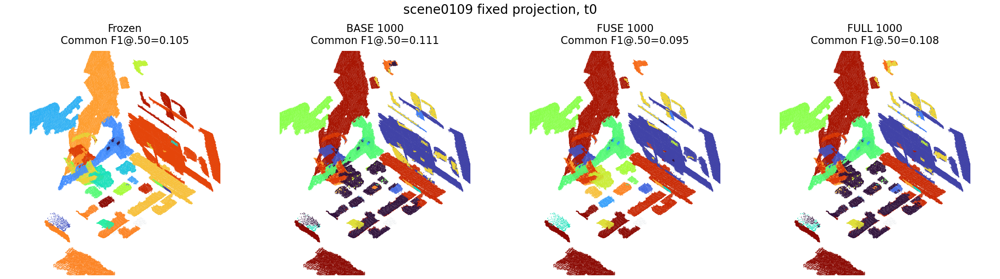
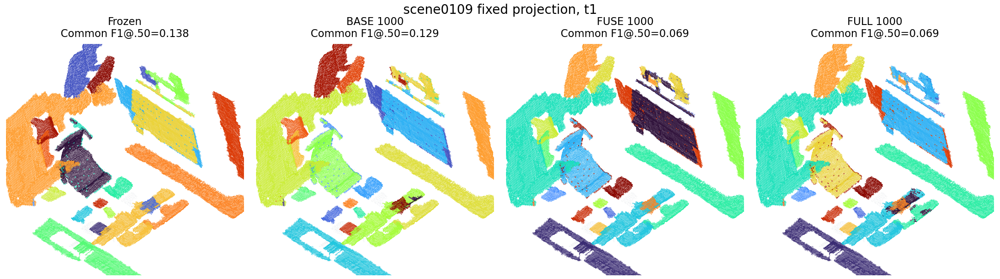

# Observation-Query Real-Training Pilot V2 Results

## Scope

This is a controlled single-environment transfer pilot. All trained methods use
the same official TRAIN pair, seed 45, frozen Concerto backbone, Q=100, T=2,
dense readout thresholds, and 1,000-update terminal budget. Evaluation uses the
previously inspected `scene0109_00-scene0109_01` DEV pair. The primary selection
metric is current-visit (`t1`) instance F1 at IoU 0.50 on
`COMMON_INPUT_SUPPORT_V2`; complete-GT and raw-query metrics remain visible.

## Real Training

| Method | Updates | Loss, first -> final | Mask loss, first -> final | Runtime | Peak GPU |
|---|---:|---:|---:|---:|---:|
| BASE_TUNED | 1,000 | 34.2577 -> 15.6977 | 0.05961 -> 0.01623 | 1,890.9 s | 2.36 GB |
| FUSE | 1,000 | 35.2597 -> 17.3420 | 0.06014 -> 0.01838 | 1,900.4 s | 2.41 GB |
| FULL | 1,000 (200 + 800 resume) | 22.5755 -> 16.1862 on resume | 0.02607 -> 0.01630 | 2,189.8 s total | 3.00 GB |

The verified FULL smoke completed 200 real optimizer updates, reloaded its
checkpoint, and then resumed cumulatively to 1,000. `training_runs.csv` contains
the exact curves, hashes, byte counts, and resource measurements.

The actual training config bytes are archived as `training_config.json` inside
each public model folder (SHA-256 `b5ff6ed04c8b922fcd34498deaadd2d199ec9e737a954c443ebda03c8c10f405`).
`pilot_training_v2.json` keeps the same model, loss, optimizer, seed, and budget,
while updating experiment identity, the materialized TRAIN split path, and V2
evaluation-domain names. It is a portable continuation config, not the literal
config file consumed by the completed runs.

## DEV Results

Terminal 1,000-update comparison at `t1`:

| Method | Full F1@.50 | Common F1@.50 | Common F1@.25 | Raw common mean IoU | Raw common AR50 | Common TP/FP/FN | Identity TP |
|---|---:|---:|---:|---:|---:|---:|---:|
| Frozen | 0.0000 | **0.1379** | **0.5517** | 0.1459 | **0.1000** | 2 / 17 / 8 | 0 |
| BASE_TUNED | 0.0000 | 0.1290 | 0.5161 | **0.1600** | **0.1000** | 2 / 19 / 8 | 0 |
| FUSE | 0.0000 | 0.0690 | **0.5517** | 0.1391 | 0.0000 | 1 / 18 / 9 | 0 |
| FULL | 0.0000 | 0.0690 | 0.4138 | 0.1019 | 0.0000 | 1 / 18 / 9 | 0 |

Best checkpoint per trained method under the predefined primary metric:

| Method | Selected update | Common F1@.50 | Raw common mean IoU | Delta F1 vs frozen | Checkpoint ID prefix |
|---|---:|---:|---:|---:|---|
| BASE_TUNED | 200 | 0.1429 | 0.1702 | +0.0049 | `c44b63f7` |
| FUSE | 200 | 0.1379 | 0.2021 | +0.0000 | `1864f349` |
| FULL | 500 | 0.1379 | 0.1543 | +0.0000 | `8fc07c8c` |

The BASE gain is one TP/FP operating-point change on one exposed DEV scene and
does not persist at 1,000 updates. FULL never exceeds BASE_TUNED or FUSE on the
primary metric. Every checkpoint has zero Full-GT F1@.50 and zero correct
persistent identity links. Thus the measured scientific signal is negative:
the present observation intervention does not show value beyond ordinary
fine-tuning or simple fusion under this pilot.

## Qualitative Evidence

At `t0`, terminal BASE_TUNED gives a small Common-F1 increase (0.105 to 0.111),
while FULL is effectively tied (0.108). This is the only improvement case in
the fixed terminal visualization.

At the current visit, all terminal trained models are below frozen. The shared
projection and source prediction hashes are recorded in
`visualization_manifest.json`.

## Evidence Boundary

The experiment uses one official TRAIN environment, one exposed DEV environment,
and one seed. No untouched confirmation environment was selected. These results
support implementation and real-training closure, but not generalization, SOTA,
or a paper-level positive claim. Machine-readable evidence is in
`configs/evaluation/results/observation_query_training_v2/`.
