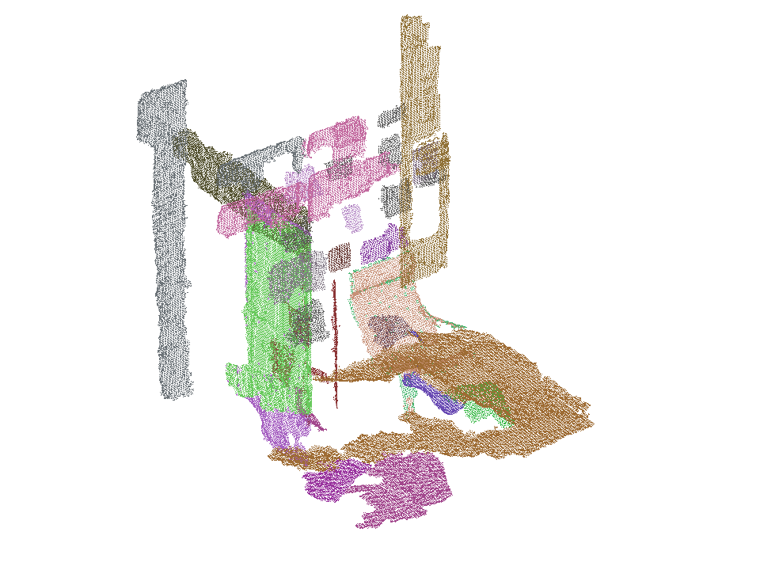
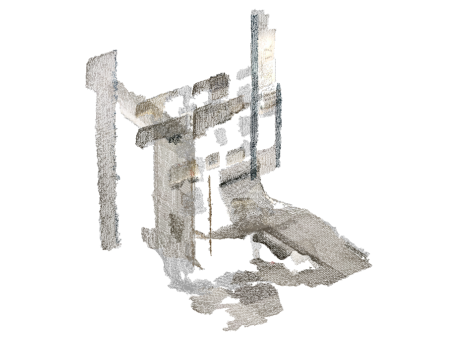
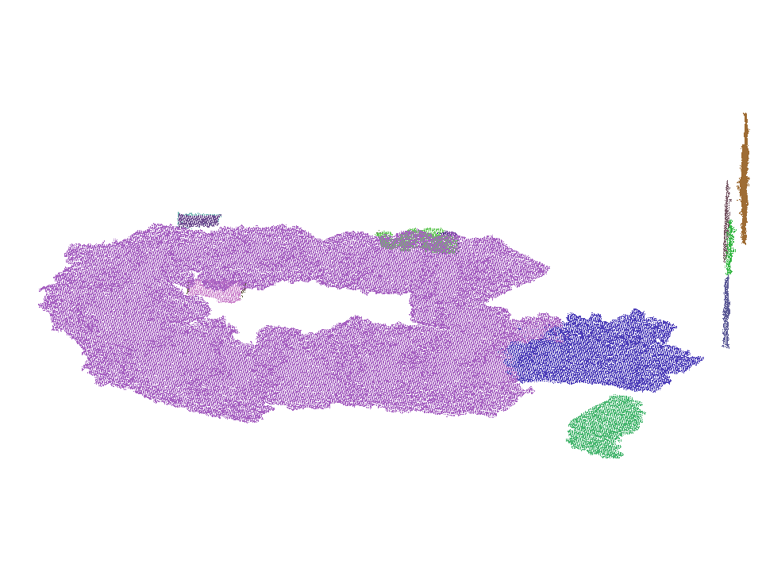
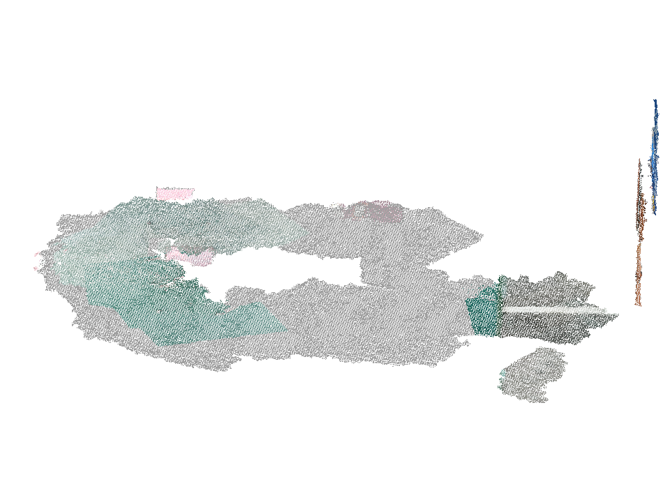
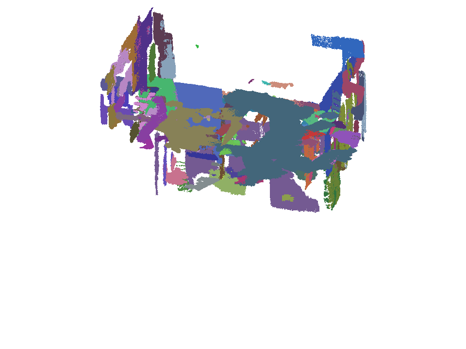
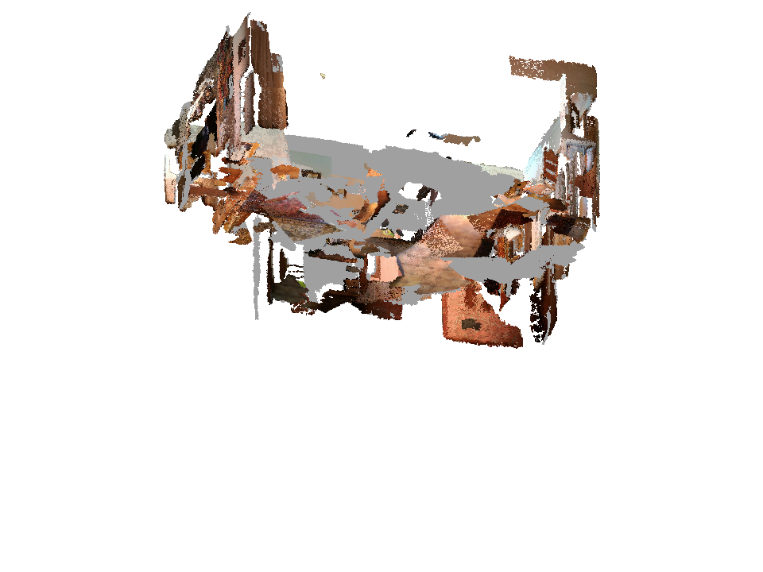

# OVI-MAP Backbone x ReScene Dense Instance Repair Results

Date: 2026-09-07

Branch: `research/ovi-rescene-dense-instance-repair`

Baseline commit: `dab81331017c7359cf2775f82351c97d2fe1c8bd`

## Scope

This experiment tests whether raw ReScene temporal masks can reorganize an
immutable OVI-MAP dense surface into better visit-specific instances. P0 is the
native OVI entity map, P1 is the frozen whole-entity U3 grouping, and P2 assigns
dense points to exclusive ReScene query owners while retaining every unsupported
or unclaimed point as OVI residual, background, or unknown. Ground truth enters
only endpoint diagnosis and evaluation.

The primary metric is exact-floor 5 cm instance IoU at 0.50; IoU 0.25 is a
sensitivity analysis. Empty cells represent null or inapplicable values, never
zero. The development pair is `scene0109_00-scene0109_01`; the frozen D2_EVAL
pairs are `scene0359_00-scene0359_01` and
`scene0459_00-scene0459_01`.

## Table A: Endpoint Diagnosis

All values below are means over evaluator GT instances. The split oracle is
`D intersect GT`; it selects only measured OVI surface and is not a method
output. Sensor-visible GT was not derived, so observation loss is not isolated.

| Pair | Visit | GT | D cover | Atomic IoU | Union IoU | Split oracle | Raw mask | Confident mask | Final P2 |
| --- | ---: | ---: | ---: | ---: | ---: | ---: | ---: | ---: | ---: |
| scene0109 | 0 | 14 | 0.2759 | 0.1113 | 0.1377 | 0.2759 | 0.0619 | 0.0322 | 0.1166 |
| scene0109 | 1 | 14 | 0.2265 | 0.1193 | 0.1910 | 0.2265 | 0.0383 | 0.0301 | 0.1161 |
| scene0359 | 0 | 9 | 0.2637 | 0.1715 | 0.2380 | 0.2637 | 0.0958 | 0.0931 | 0.1742 |
| scene0359 | 1 | 9 | 0.1531 | 0.0887 | 0.1328 | 0.1531 | 0.0497 | 0.0431 | 0.0964 |
| scene0459 | 0 | 59 | 0.3787 | 0.1334 | 0.1614 | 0.3787 | 0.0714 | 0.0572 | 0.1307 |
| scene0459 | 1 | 59 | 0.3676 | 0.1245 | 0.1557 | 0.3676 | 0.0610 | 0.0541 | 0.1211 |

Every one of the 164 endpoint rows remains conservatively labeled `mixed`.
The consistent gap between the split oracle and raw masks localizes substantial
loss before exclusive P2 conflict resolution. The additional gap from complete
GT to the split oracle shows that fixed OVI geometry/coverage is also limiting.
Six scene0459 rows exceed the 12-candidate exact-union limit and are explicitly
labeled greedy; their union values are not claimed as exact ceilings. Applying
the fixed 0.3 confidence rule lowers mean raw-mask IoU on every visit. Final P2
can exceed one raw mask by retaining OVI residual candidates, but remains far
below the point-level split oracle.

## Table B: Instance Quality

Counts pool the two visits within each pair. Macro is the unweighted mean of
the three pair-level F1 values; micro recomputes F1 from pooled counts.

| Pair / aggregate | Method | TP / FP / FN @0.50 | F1@0.50 | TP / FP / FN @0.25 | F1@0.25 |
| --- | --- | ---: | ---: | ---: | ---: |
| scene0109 | P0 | 0 / 50 / 28 | 0.0000 | 4 / 46 / 24 | 0.1026 |
| scene0109 | P1 | 0 / 46 / 28 | 0.0000 | 5 / 41 / 23 | 0.1351 |
| scene0109 | P2 | 0 / 53 / 28 | 0.0000 | 4 / 49 / 24 | 0.0988 |
| scene0359 | P0 | 0 / 23 / 18 | 0.0000 | 4 / 19 / 14 | 0.1951 |
| scene0359 | P1 | 0 / 19 / 18 | 0.0000 | 4 / 15 / 14 | 0.2162 |
| scene0359 | P2 | 0 / 29 / 18 | 0.0000 | 2 / 27 / 16 | 0.0851 |
| scene0459 | P0 | 0 / 238 / 118 | 0.0000 | 20 / 218 / 98 | 0.1124 |
| scene0459 | P1 | 0 / 203 / 118 | 0.0000 | 19 / 184 / 99 | 0.1184 |
| scene0459 | P2 | 0 / 283 / 118 | 0.0000 | 19 / 264 / 99 | 0.0948 |
| micro | P0 | 0 / 311 / 164 | 0.0000 | 28 / 283 / 136 | 0.1179 |
| micro | P1 | 0 / 268 / 164 | 0.0000 | 28 / 240 / 136 | 0.1296 |
| micro | P2 | 0 / 365 / 164 | 0.0000 | 25 / 340 / 139 | 0.0945 |
| pair macro | P0 | - | 0.0000 | - | 0.1367 |
| pair macro | P1 | - | 0.0000 | - | 0.1566 |
| pair macro | P2 | - | 0.0000 | - | 0.0929 |

P2 does not improve the primary metric or the sensitivity metric. P1 is the
best sensitivity result, but its pair-macro gain over P0 is only 0.0199 and no
method produces any IoU-0.50 true positive.

## Table C: Persistent Identity and Fixed-P2 Association

At IoU 0.50, every system and every G/F/R association has zero TP, zero
conditional endpoint GT, and zero rigid recall. The tables below therefore show
the only nonzero sensitivity results at IoU 0.25, pooled over 77 persistent GT
identities and 16 rigid identities. `Endpoint fail` means the proposed pair does
not have two valid fixed GT endpoint bindings.

System identity:

| Method | Domain | Pairs | TP / FP | Endpoint fail | Precision | E2E recall | Conditional TP / GT | Rigid TP / GT |
| --- | --- | ---: | ---: | ---: | ---: | ---: | ---: | ---: |
| P0 | full | 0 | 0 / 0 | 0 | null | 0.0000 | 0 / 5 | 0 / 16 |
| P1 | full | 12 | 0 / 12 | 12 | 0.0000 | 0.0000 | 0 / 4 | 0 / 16 |
| P1 | supported | 12 | 1 / 11 | 11 | 0.0833 | 0.0130 | 1 / 5 | 0 / 16 |
| P2 | full | 4 | 0 / 4 | 4 | 0.0000 | 0.0000 | 0 / 5 | 0 / 16 |
| P2 | supported | 4 | 0 / 4 | 4 | 0.0000 | 0.0000 | 0 / 6 | 0 / 16 |

Association on the fixed joint-query-derived P2 candidate pool:

| Method | Domain | Pairs | TP / FP | Endpoint fail | Precision | E2E recall | Conditional TP / GT | Rigid TP / GT |
| --- | --- | ---: | ---: | ---: | ---: | ---: | ---: | ---: |
| G full | full | 173 | 4 / 169 | 169 | 0.0231 | 0.0519 | 4 / 5 | 0 / 16 |
| G supported | supported | 139 | 5 / 134 | 134 | 0.0360 | 0.0649 | 5 / 6 | 0 / 16 |
| F object | supported | 136 | 2 / 134 | 134 | 0.0147 | 0.0260 | 2 / 6 | 0 / 16 |
| R object | supported | 13 | 1 / 12 | 12 | 0.0769 | 0.0130 | 1 / 6 | 0 / 16 |

The higher conditional values do not overcome the endpoint ceiling: only six
of 77 identities have supported P2 endpoints even at IoU 0.25. The candidate
pool itself is produced by joint ReScene queries, so this table is not an
independent proof of temporal-network causality. No same-class mismatch is
counted because endpoint failure occurs first.

## Table D: Current Map and Historical Recovery

| Variant | Status | New correct | Known wrong | Unknown | Deleted correct | Old residue | Recovery opportunity |
| --- | --- | ---: | ---: | ---: | ---: | ---: | ---: |
| C0 | NOT_RUN_INELIGIBLE | null | null | null | null | null | not established |
| C_G | NOT_RUN_INELIGIBLE | null | null | null | null | null | not established |
| C_R | NOT_RUN_INELIGIBLE | null | null | null | null | null | not established |
| O_ID | NOT_RUN_INELIGIBLE | null | null | null | null | null | not established |
| O_POSE | NOT_RUN_INELIGIBLE | null | null | null | null | null | not established |

The preregistered condition requires either a new valid rigid endpoint pair at
IoU 0.50 or an explicit measured recoverable surface. P2 and fixed-P2 G/F/R have
zero primary-threshold TP and zero rigid recall, while sensor-visible GT was not
derived. Recovery was therefore not run. These cells are null rather than zero;
no current-map surface or distance gain is claimed.

## Table E: Measured Resources

Times are instrumented stage times in seconds. Association time excludes source
loading. Peak GPU memory is allocated memory for the cached joint forward.

| Pair | Frames | Dense points | Independent forward | Joint forward | GPU peak | P2 build | Instance eval | Identity eval | Artifact export | Association |
| --- | ---: | ---: | ---: | ---: | ---: | ---: | ---: | ---: | ---: | ---: |
| scene0109 | 63 + 53 | 1609563 | 0.4869 + 0.1624 | 0.4385 | 1.100 GB | 1.7368 | 2.1493 | 8.2900 | 2.6961 | 11.4719 |
| scene0359 | 125 + 106 | 2447001 | 0.6115 + 0.1789 | 0.8152 | 1.043 GB | 2.5039 | 3.6897 | 10.5404 | 3.8070 | 13.3522 |
| scene0459 | 592 + 582 | 12080346 | 0.8636 + 0.2992 | 0.8078 | 4.177 GB | 36.5446 | 18.2996 | 69.1995 | 43.7548 | 93.9689 |

All forwards used one NVIDIA A40 and the same 796-tensor checkpoint. Each new
D2 visit used one CropFormer frontend pass and one independent native OVI-MAP
mapping. The new mapping manifests did not instrument wall time or peak memory,
so those values are not inferred from timestamps. No training, D1 re-forward,
or recovery forward was executed.

## Dense Output Audit

| Pair | Visit | P2 raw / final | Split parents | Merged candidates | Query / residual / BG / unknown | Dense points |
| --- | ---: | ---: | ---: | ---: | ---: | ---: |
| scene0109 | 0 | 83 / 31 | 5 | 2 | 0.0413 / 0.9450 / 0.0137 / 0 | 820617 |
| scene0109 | 1 | 65 / 22 | 4 | 2 | 0.2047 / 0.7617 / 0.0336 / 0 | 788946 |
| scene0359 | 0 | 62 / 14 | 5 | 1 | 0.0395 / 0.9605 / 0 / 0 | 1419750 |
| scene0359 | 1 | 52 / 15 | 5 | 1 | 0.0288 / 0.9712 / 0 / 0 | 1027251 |
| scene0459 | 0 | 87 / 145 | 55 | 19 | 0.1647 / 0.8319 / 0.0033 / 0 | 6483678 |
| scene0459 | 1 | 74 / 138 | 52 | 17 | 0.2066 / 0.7932 / 0.0002 / 0 | 5596668 |

P2 crosses complete OVI entity boundaries on every pair through both split and
merge ownership. Every P0/P1/P2 row has `source_point_count ==
final_point_count` and `geometric_change_count == 0`; the exact dense XYZ and
row order are preserved. On scene0459, many residual instances remain beside
query fragments, so final count can exceed raw query count.

## Claim Boundary

Supported:

- two frozen D2_EVAL pairs were independently reconstructed by native OVI-MAP
  and evaluated without pair-specific retuning;
- raw ReScene masks can split and merge native OVI entities while conserving
  the complete dense surface and explicit unsupported ownership;
- the measured endpoint loss occurs in both fixed OVI coverage and raw-mask
  quality, before the final exclusivity rule;
- P1 provides a small IoU-0.25 organization gain over P0 in pair-macro F1.

Not supported:

- any IoU-0.50 instance improvement, because every method records zero TP;
- a P2 instance-quality gain, semantic-quality gain, geometry gain, SOTA claim,
  or broad generalization claim;
- decoder adaptation or partial-observation network robustness, because no
  training and no actual D1 re-forward were run;
- successful current-map recovery, because Table D records no eligible measured
  opportunity and no recovery execution.

| Claim | Authoritative evidence | Status |
| --- | --- | --- |
| P2 changes ownership across OVI boundaries without moving XYZ | aggregate `instance_metrics.csv`; local P2 manifests | supported on three pairs |
| P2 improves instance quality | aggregate `instance_metrics.csv` | unsupported; lower IoU-0.25 macro/micro F1 and zero TP at 0.50 |
| ReScene association fixes persistent identity | aggregate `identity_metrics.csv` and `association_metrics.csv` | unsupported at 0.50; sensitivity-only matches with zero rigid recall at 0.25 |
| Historical recovery improves the current map | `recovery_status.json` | unsupported; not eligible or run |
| Result generalizes beyond selected validation environments | frozen pair manifest | unsupported |

## Representative Outputs

The fixed-camera previews include success and failure cases rather than a
curated positive-only subset. Instance colors identify ownership, not semantic
class correctness.

| Pair | P2 instance ownership | Source RGB |
| --- | --- | --- |
| scene0109 |  |  |
| scene0359 |  |  |
| scene0459 |  |  |
