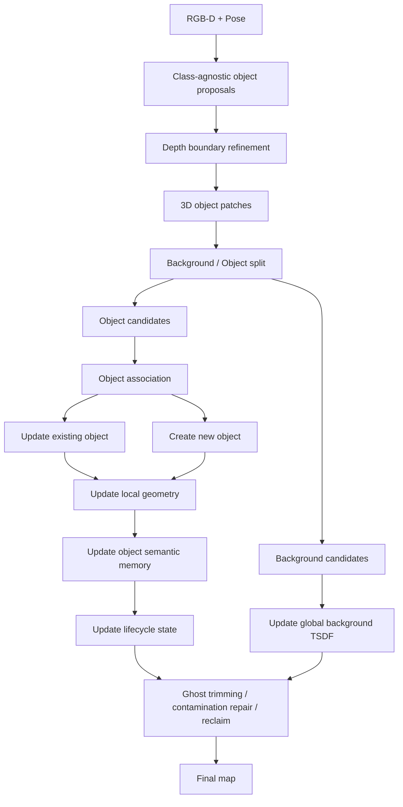

# Method Overview: Sustainable Open-Vocabulary Dynamic Mapping

## 1. Goal

Build an online open-vocabulary map for dynamic scenes with:

* background/object decoupled maintenance
* instance-first association
* object-level semantic memory
* long-term dynamic maintenance

---

## 2. Input / Output

### Input

* RGB-D stream
* camera poses from SLAM

### Output

* global background map `M_bg`
* object set `M_obj = {O_1, O_2, ...}`
* open-vocabulary labels for objects
* object lifecycle states
* dynamic-cleaned map without long-term ghost accumulation

---

## 3. Core Representation

### 3.1 Background Map

`M_bg`: global TSDF

Stores:

* wall / floor / static layout
* stable large-scale background geometry

### 3.2 Object Map

Each object `O_i` stores:

* `object_id`
* `pose`
* `geometry_local`
* `bbox_3d`
* `semantic_memory`
* `view_memory`
* `observation_history`
* `state`
* `confidence`

Recommended:

* v1: `geometry_local = local point cloud / surfels`
* v2: `geometry_local = local TSDF block`

---

## 4. Key Idea

Do **not** fuse open-vocabulary semantics directly into a single global 3D map.

Instead:

1. build class-agnostic object instances first
2. associate new observations by spatial consistency
3. maintain background and objects separately
4. update semantics only at object level
5. perform long-term ghost cleanup and re-identification

---

## 5. Pipeline

---

## 6. Modules

### A. Object Proposal

Generate class-agnostic object masks from RGB.

Input:

* RGB
* depth

Output:

* 2D masks

Notes:

* use SAM2
* no semantic class decision here

---

### B. Depth Refinement

Refine masks using depth discontinuity.

Input:

* 2D masks
* depth

Output:

* refined masks

Purpose:

* separate adjacent objects
* reduce object-background sticking
* improve 3D lifting boundary quality

---

### C. 3D Patch Lifting

Lift each refined mask into world coordinates.

Input:

* refined mask
* depth
* pose

Output:

* `patch_k = {points, normals(optional), time}`

---

### D. Background / Object Split

Decide whether each patch belongs to background or object layer.

Input:

* 3D patch
* `M_bg`
* `M_obj`

Output:

* background patch
* object patch
* ambiguous patch

Criteria:

* planar/background consistency
* motion inconsistency
* support relation
* historical object compatibility

---

### E. Object Association

Associate each object patch to an existing object.

Input:

* object patch
* object set `M_obj`

Output:

* matched object id or new object id

Rule:

* spatial consistency first
* semantics only as weak auxiliary signal

Association cues:

* centroid distance
* bbox overlap
* local geometry overlap
* support relation
* pose proximity

---

### F. Object Geometry Update

Update the local geometry of object `O_i`.

Input:

* associated object
* object patch

Output:

* updated `geometry_local`
* updated `bbox_3d`
* updated `pose`

v1:

* local point cloud / surfels

v2:

* local TSDF block for stable objects

---

### G. Semantic Memory Update

Update object-level open-vocabulary semantics.

Input:

* object crop
* masked crop
* object id

Output:

* updated `semantic_memory`
* updated top-k labels

Rule:

* update only for informative new views
* aggregate at object level
* suppress outlier semantic observations

Stored:

* feature mean / bank
* top-k label hypotheses
* confidence history

---

### H. Background Update

Update only the stable background layer.

Input:

* background patch
* object occupancy mask

Output:

* updated `M_bg`

Rule:

* foreground object region does not directly write into background
* newly revealed stable surfaces can be reclaimed by background
* background decay should be delayed, not aggressive

---

### I. Dynamic Maintenance

Long-term maintenance module.

#### I1. Ghost Trimming

Remove stale geometry from old object poses.

#### I2. Boundary Contamination Repair

Reassign boundary points/voxels between nearby objects when polluted.

#### I3. Background Reclaim

When an object moves away, release its old occupied region back to background.

#### I4. Split / Merge Check

Detect whether one object should split or two objects should merge.

---

### J. Lifecycle Management

Maintain persistent object identity.

States:

* `active`
* `occluded`
* `moved`
* `inactive`
* `reappeared`
* `removed`

Re-ID cues:

* geometry signature
* size / bbox
* semantic memory
* support relation
* past trajectory prior

---

## 7. Main Innovation Points

### 1. Dual-layer map

* global TSDF for background
* local geometry for each object

### 2. Instance-first mapping

* association by spatial consistency
* semantics updated after object identity is stabilized

### 3. Object-level open-vocabulary memory

* no dense per-voxel language feature fusion
* semantics maintained per object

### 4. Sustainable dynamic maintenance

* ghost trimming
* contamination repair
* background reclaim
* lifecycle-aware re-identification

---

## 8. Minimal v1

Implement first:

* global background TSDF
* local object point cloud
* class-agnostic mask proposal
* depth refinement
* spatial-first object association
* object semantic memory
* simple ghost trimming
* inactive / reappeared lifecycle

Do later:

* local object TSDF
* split / merge optimization
* learned semantic merger
* scene graph backend

---

## 9. One-Sentence Summary

A dual-layer dynamic open-vocabulary mapping system that uses a global TSDF for background, local object maps for foreground, spatial-first instance association, object-level semantic memory, and lifecycle-aware dynamic maintenance.
